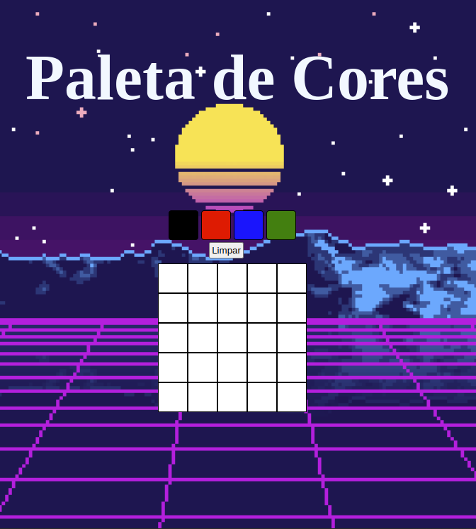

# BEM-VINDO AO PIXEL ART

## SOBRE:

Este projeto foi desenvolvido como forma de praticar e desenvolver determinadas habilidades do módulo de fundamentos, do curso de formação em programação da Trybe.
Ele consiste em um quadro de pixel que o usuário pode selecionar algumas cores e fazer um desenho. Isso ocorre dinamicamente ao clicar das cores disponíveis no quadro de cores. **Este foi o meu segundo projeto criado e o primeiro com algum evento de JavaScript.**

## IMAGEM DO PROJETO:

### TECNOLOGIAS USADAS NO DESENVOLVIMENTO: 

- HTML
  
- CSS
  
- JavaScript

### HABILIDADES:

- Manipular o DOM

- Manipular o Javascript
  
### FEATURES

- [x] Adicionar título.
- [x] Adicionar paleta de cores.
- [x] Selecionar cor para ser a primeira cor inicial.
- [x] Criar um quadro com 25 pixels.
- [x] Poder pintar o quadro a partir de uma cor escolhida.
- [x] Criar botão para limpar o quadro de pixels.